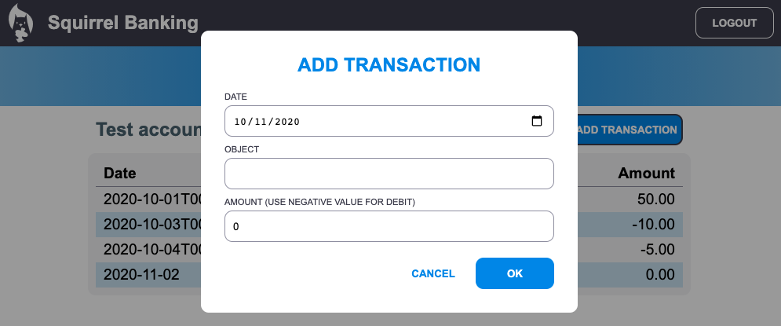

# Laksanakan dialog "Tambah transaksi"

## Arahan

Aplikasi bank kami masih belum mempunyai satu ciri penting: kemungkinan untuk melakukan transaksi baru.
Menggunakan semua yang telah anda pelajari dalam empat pelajaran sebelumnya, laksanakan dialog "Tambah transaksi":

- Tambahkan butang "Tambah transaksi" di halaman papan pemuka
<<<<<<< HEAD
- Buat halaman baru dengan templat HTML, atau gunakan JavaScript untuk menunjukkan / menyembunyikan HTML dialog tanpa meninggalkan halaman papan pemuka (anda boleh menggunakan [`hidden`](https://developer.mozilla.org/en-US/docs/Web/HTML/Global_attributes/hidden) property for that, or CSS classes) untuk itu, atau kelas CSS)
=======
- Buat halaman baru dengan templat HTML, atau gunakan JavaScript untuk menunjukkan / menyembunyikan HTML dialog tanpa meninggalkan halaman papan pemuka (anda boleh menggunakan [`hidden`](https://developer.mozilla.org/docs/Web/HTML/Global_attributes/hidden) property for that, or CSS classes) untuk itu, atau kelas CSS)
>>>>>>> 9aa98943f8d4b570e8fbdcc01d8a56a118c2762a
- Pastikan anda mengendalikan [kebolehcapaian pembaca papan kekunci dan skrin](https://developer.paciellogroup.com/blog/2018/06/the-current-state-of-modal-dialog-accessibility/) untuk dialog
- Terapkan borang HTML untuk menerima data input
- Buat data JSON dari data formulir dan kirimkan ke API
- Kemas kini halaman papan pemuka dengan data baru

Lihat [server API specifications](../../api/README.ms.md) untuk melihat API mana yang perlu anda panggil dan format JSON yang diharapkan.

Inilah hasil contoh setelah menyelesaikan tugasan:

## Rubrik

| Kriteria | Contoh                                                                                        | Mencukupi                                                                                                                | Usaha Lagi                          |
| -------- | ------------------------------------------------------------------------------------------------ | ----------------------------------------------------------------------------------------------------------------------- | --------------------------------------------|
|          | Menambah transaksi dilaksanakan sepenuhnya mengikuti semua amalan terbaik yang dilihat dalam pelajaran. | Menambah urus niaga dilaksanakan, tetapi tidak mengikuti amalan terbaik yang dapat dilihat dalam pelajaran, atau hanya bekerja sebahagian. | Menambah urus niaga tidak berfungsi sama sekali. |
